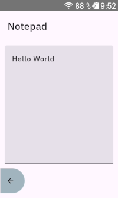
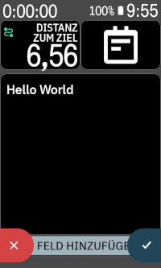
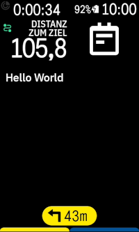

# Karoo Notepad Extension

Karoo extension that provides a simple text datafield to place your notes.

Compatible with Karoo 2 and Karoo 3 devices.

## Installation

If you are using a Karoo 3, you can use [Hammerhead's sideloading procedure](https://support.hammerhead.io/hc/en-us/articles/31576497036827-Companion-App-Sideloading) to install the app:

1. Using the browser on your phone, long-press [this download link](https://github.com/timklge/karoo-notepad/releases/latest/download/app-release.apk) and share it with the Hammerhead Companion app.
2. Your karoo should show an info screen about the app now. Press "Install".
3. Set up your data fields as desired.

If you are using a Karoo 2, you can use manual sideloading:

1. Download the apk from the [releases page](https://github.com/timklge/karoo-notepad/releases) (or build it from source)
2. Set up your Karoo for sideloading. DC Rainmaker has a great [step-by-step guide](https://www.dcrainmaker.com/2021/02/how-to-sideload-android-apps-on-your-hammerhead-karoo-1-karoo-2.html).
3. Install the app by running `adb install app-release.apk`.
4. Set up your data fields as desired.

## Usage

After installation, add the Notepad data field to your data pages as desired.
Open the extension from the main menu to edit the note text.
You can also add a button to your pages that opens the text editor.

## Credits

- Icon is `notepad` by [boxicons.com](https://boxicons.com) (MIT-licensed).

## Links

[karoo-ext source](https://github.com/hammerheadnav/karoo-ext)
